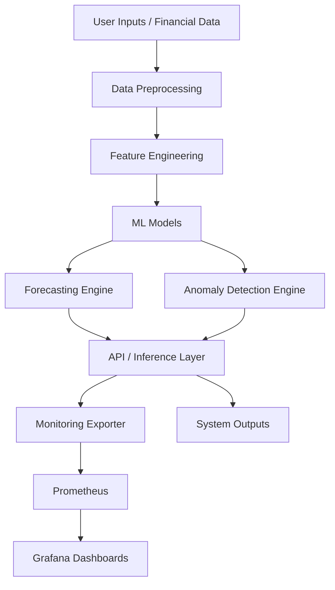
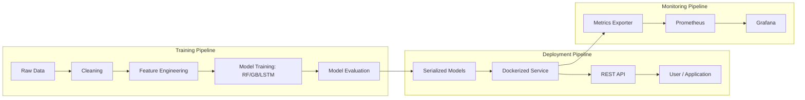

# **CentricAI – AI-Powered Personal Finance Advisor**

## **1. Project Overview**

CentricAI is an end-to-end intelligent personal finance system designed to analyze user behavior, forecast spending patterns, detect anomalies, and support financial decision-making. This project demonstrates the complete lifecycle of a modern AI system—from data preprocessing and model deployment to monitoring, evaluation, and documentation.

The primary objectives of CentricAI include:

* Delivering accurate monthly spending forecasts
* Detecting unusual or risky financial behavior through anomaly detection
* Enabling reliable, reproducible deployment using containerization
* Providing real-time monitoring and performance metrics
* Ensuring transparency and trustworthiness through documentation and governance

This repository serves as a professional demonstration of how an AI engineer designs, deploys, and maintains a production-ready ML system.

---

## **2. Repository Contents**

### **📁 src/**

Core system source code:

* `main.py` — Entry point executing the system pipeline
* `models/` — ML models and loading utilities
* `utils/` — Preprocessing, metrics, and logging modules
* `data/` — Sample datasets for demonstration
* `requirements.txt` — Python dependencies

### **📁 deployment/**

Deployment and containerization files:

* `Dockerfile` — Container image definition
* `docker-compose.yml` — Multi-service orchestration (optional)

### **📁 monitoring/**

System monitoring configuration:

* `prometheus/` — Metric scrapers and alerting rules
* `grafana/` — Dashboard and datasource configuration

### **📁 documentation/**

Lifecycle documentation:

* Project proposal template
* Final system report (if included)

### **📁 videos/**

* `system_demo.mp4` — Screencast demonstrating the full system

### `.gitignore`

Ignore rules for Python, logs, models, and videos.

---

## **3. System Entry Point**

The core system runs from:

```
src/main.py
```

### **Running Locally**

```
pip install -r src/requirements.txt
python src/main.py
```

### **Running with Docker**

```
docker build -t centricai ./deployment
docker run centricai
```

### **Running with Docker Compose**

```
docker-compose up --build
```

---

## **4. Video Demonstration**

A full real-world walkthrough is included in:

```
videos/system_demo.mp4
```

This demo shows:

* The end-to-end pipeline running
* Anomaly detection and spending forecasts
* Deployment setup and configuration
* Prometheus metrics scraping
* Grafana dashboards monitoring system performance

---

## **5. Deployment Strategy**

CentricAI uses a Docker-based deployment strategy.

Key components:

* Lightweight Python container image
* Reproducible environment with `requirements.txt`
* Optional multi-container orchestration via `docker-compose.yml`

Deployment files:

```
deployment/Dockerfile
deployment/docker-compose.yml
```

The structure supports future expansion to Kubernetes, cloud deployments, or CI/CD integration.

---

## **6. Monitoring and Metrics**

The project includes a full monitoring stack using:

* **Prometheus** — Scrapes system metrics (latency, errors, accuracy)
* **Grafana** — Visual dashboards of model and system performance

### **Setup**

To start monitoring services:

```
docker-compose up --build
```

Prometheus configuration:

```
monitoring/prometheus/prometheus.yml
```

Grafana dashboard definitions:

```
monitoring/grafana/dashboards.json
```

### **Metrics Tracked**

* API request latency
* Forecasting accuracy
* Anomaly counts
* Model inference time
* System errors and warnings
* Resource utilization

---

## **7. Project Documentation**

All supporting documents are under:

```
documentation/
```

Includes:

* **AI System Project Proposal**
* **Project Report** (optional, if completed)

These provide context on design choices, risk management, model development, and system evaluation.

---

## **8. Version Control & Collaboration**

This project follows standard Git-based workflow practices:

### **Branching Model**

* `main` — Stable releases
* `dev` — Development branch
* Feature branches — For isolated improvements

### **Code Review & PR Workflow**

* Pull requests required before merging
* Review includes checks for documentation, tests, and reproducibility

### **Task Management**

* GitHub Issues for tracking bugs and tasks
* GitHub Projects for feature planning and timeline management

Even as a solo project, these practices ensure clarity, organization, and professionalism.

---

## **9. If Not Applicable**

If a component in the repository is not used, explain briefly why.

Examples:

* Grafana not used because metrics were logged locally instead.
* `docker-compose.yml` included as a template but not required.
* CI/CD omitted due to scope limitations.

This maintains transparency and helps future collaborators or reviewers understand your design decisions.

---

## **10. System Architecture Diagram**



This diagram illustrates the flow of data through the system—from ingestion and feature transformation, through ML inference, and finally into monitoring and visualization tools.

---

## **11. AI System Overview Diagram**



This covers the end-to-end lifecycle: training, deployment, and monitoring.

---

## **End of README**